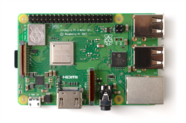
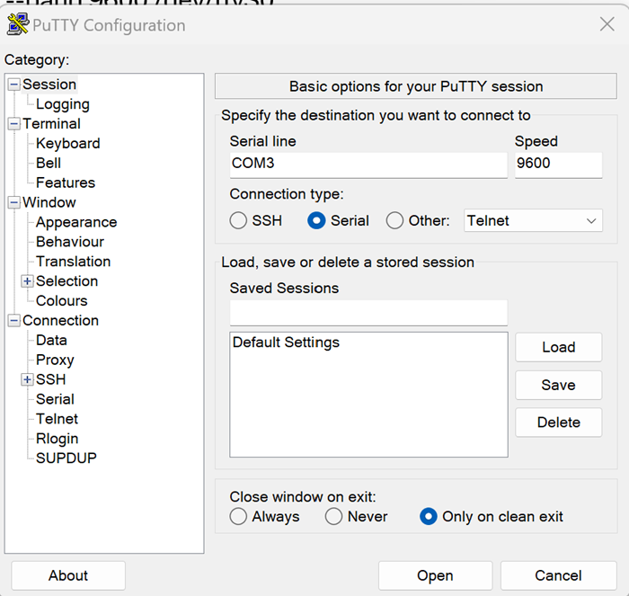
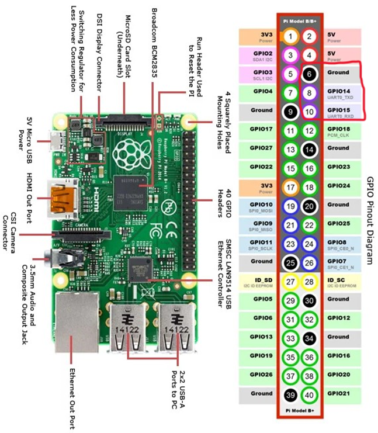

# Mobile Tracking System
<p>University of Utah Computer Engineering Senior Capstone by Kirra Kotsenburg, Nicholas Ronnie, and Charlotte Saethre. </p>
<hr>
<div style="display: flex; justify-content: space-between;">



</div>
<hr>

<p>This project explores the use of a Raspberry Pi 3B+, Camera module, Qt Desktop Application, and OpenCV tracking algorithms to acheive a mobile tracking system that interfaces with a drone.</p>

For video transmission we are using [AKK X2M 5.8Ghz Switchable FPV Transmitter](https://www.amazon.com/gp/product/B0773JVM8M/ref=ox_sc_act_image_1?smid=ADP3MHCS3NLR7&psc=1) and the [SoloGood FPV Receiver](https://www.amazon.com/gp/product/B08YJGCVJS/ref=ox_sc_act_image_2?smid=A2XZ0PQGR3TYBH&psc=1)

This project works along side our TrackerApp project for the user desktop application which you can access [here](https://github.com/KirraKotsenburg/TrackerApp).

## Usage

To run in the current state:
```shell
sudo systemctl stop serial-getty@ttyS0.service
sudo systemctl disable serial-getty@ttyS0.service
cd build
make
sudo ./TestMain
```
This will run the tracking application with a walking video to test the tracking capability and UART communication functionality. 

Note* tracker.sh is a bash script (in progress) that will automate these commands and allow us to run this on power up for the final product. You can copy this bash script to your home directory and run it with 
```shell
./tracker.sh
```
This will execute the stop/disable getty commands for the ttyS0, cd into our project and run the application. 

### Set Up
1. Create SSH key on Raspberry Pi (Linux based system).
    In a terminal type the following command:
    ```shell
    ssh-keygen
    ```
    a. Press enter for default file location (default directory is at /home/pi/.ssh/id_rsa).

    b. Press enter for passphrase
2. Copy the generated SSH key:
    ```shell
    cat ~/.ssh/id_rsa.pub
    ```
3. With the key copied go to your GitHub account > Settings > SSH and GPG keys > Click New SSH key. Provide a name and copy the key and click Add SSH key. 

4. Once you have your GitHub account set up with your key you can clone the project
    ```shell
    git clone git@github.com:csaethre19/MobileTargetTracking.git
    ```

### Camera Module

Commands to get camera settings on Raspberry pi:
```shell
sudo apt-get install v4l-utils
v4l2-ctl --list-formats-ext
v4l2-ctl --set-fmt-video=width=1920,height=1080,pixelformat=BGR3
v4l2-ctl --set-parm=30
```

### Transmitter
```shell
sudo nano /boot/config.txt
```
Underneath #hdmi_safe=1 add the following: <br>
disable_overscan = 0 <br>
enable_tvout=1 <br>

### OpenCV
It is necessary to build OpenCV from source on the Raspberry Pi itself.
Follow the instructions [here](https://qengineering.eu/install-opencv-on-raspberry-pi.html) to do this if you do not have OpenCV.

### UART 
#### Enable UART on Raspberry Pi for serial device ttyS0:
```shell
cd /dev
/dev ls -l
```
This lists devices - we will see ttyAMA0 but we need ttyS0 for our UART interface, so we need to enable this.

```shell
sudo nano /boot/config.txt
```
Scroll to end of file and add: enable_uart=1
save and exit (To save in nano hit CTRL+O then enter and to exit hit CTRL+X)

#### PuTTY Console and UART Device Setup:
Open PuTTY session using COM3 as serial line (or whatever device name UART device comes up as) and leave speed to default (9600) for testing swarm-dongle UART communication. (Testing for gimbal communication has not yet been added and may require a different speed set – 115200).



For serial port ttyS0 wiring:
- Using UART device connect ground to ground pin on Raspberry Pi (pin 6).
- Connect RX pin on UART device to UART0_TXD on Raspberry Pi (pin 8).
- Connect TX pin on UART device to UART0_RXD on Raspberry Pi (pin 10).



Note* The [TrackerApp desktop application](https://github.com/KirraKotsenburg/TrackerApp) replaces the use of this PuTTY setup but is here in case of testing purposes. 

## Testing

To use gtest testing framework set up with the following commands:

```shell
sudo apt-get update
sudo apt-get install libgtest-dev
cd /usr/src/gtest
sudo cmake CMakeLists.txt
sudo make
sudo cp *.a /lib
```
To add tests in CMakeLists.txt:

add_executable(\<TestName> tests/<TestFile.cpp>) <br>
target_link_libraries(\<TestName> PRIVATE GTest::gtest GTest::gtest_main) <br>
add_test(NAME my_test COMMAND \<TestName>) <br>

To run: <br>
./\<TestName>

## Logging
All log files will be found inside a logs folder within the build folder.